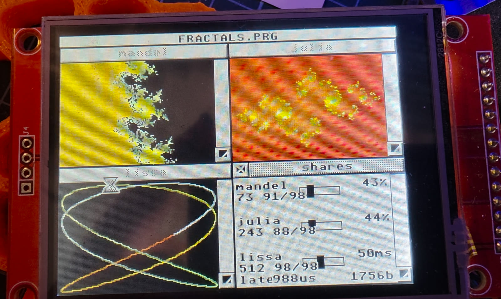

# Fractals — three computations sharing one core

Four GEM windows. A Mandelbrot set, a Julia set, an animated Lissajous figure,
and a panel whose sliders decide, while you watch, how the processor is divided
between the first three.

This is the demonstration of what the kernel actually does. Move the Mandelbrot
slider up and its picture builds faster while the Julia set slows down — and
the Lissajous figure keeps its tempo regardless, because it is not competing
for a share at all.

## Two kinds of task, on purpose

| | kind | what it asks for |
| --- | --- | --- |
| `mandel` | `set_normal` | a **share** of the core, set by its slider |
| `julia` | `set_normal` | a share, set by its slider |
| `lissa` | `set_cyclic` | a **period**, 10 to 100 ms, set by its slider |

In IRKernel a priority is a share, not a rank: a task gets processor time in
the ratio of its own priority to the sum of all the others, so no task can
starve another however the sliders are set. The panel prints the share each
task actually received, which is the honest number — not the one it asked for.

The Lissajous figure is cyclic because a waving figure wants an even tempo
rather than as much processor as it can get. `late` under it is the worst gap
between two activations, measured against the period it asked for.

## Nothing preempts anything

A task holds the core until it gives way. Each of these yields after **every
single line** of its picture — which is why the fractals grow downwards in
front of you instead of appearing whole. That is the bargain the kernel makes:
no preemption to pay for, so a handover costs a function call, and in return
every task has to hand back by itself.

## How the halves talk

Each task fills a canvas of RGB565 pixels in memory both halves can see; the
GEM half copies the canvas into the window with one `vro_cpyfm()`. No messages
per frame — at this rate that would be the wrong mechanism. The canvas is the
full 320×240 so a window may be sized up to the whole screen.

The picture is never cleared before it is redrawn, which is why it does not
flicker white between frames.

## The zoom

Each fractal zooms by 6 % per finished frame and starts again when it reaches
`SPAN_MIN`. That limit is arithmetic, not taste: the coordinates are single
precision floats carrying about seven decimal digits, and once neighbouring
pixels round to the same number the picture turns to blocks. It stops just
before that.

Single precision is deliberate — the Cortex-M33 has a single-precision FPU, so
`float` is hardware and `double` would be software.

## Running it

DEPLOY has to be listening on the machine (`Desk → Deploy`), then press
**Upload**. The program lands on `C:\` and starts.

Closing the panel window ends the program.

See [../README.md](../README.md) for the sketchbook, and
[docs/gemduino.md](../../../docs/gemduino.md) for the set-up.
