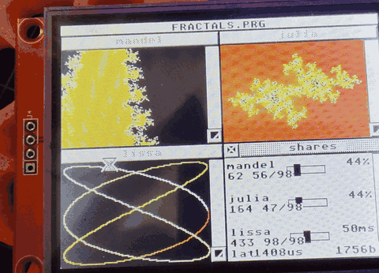
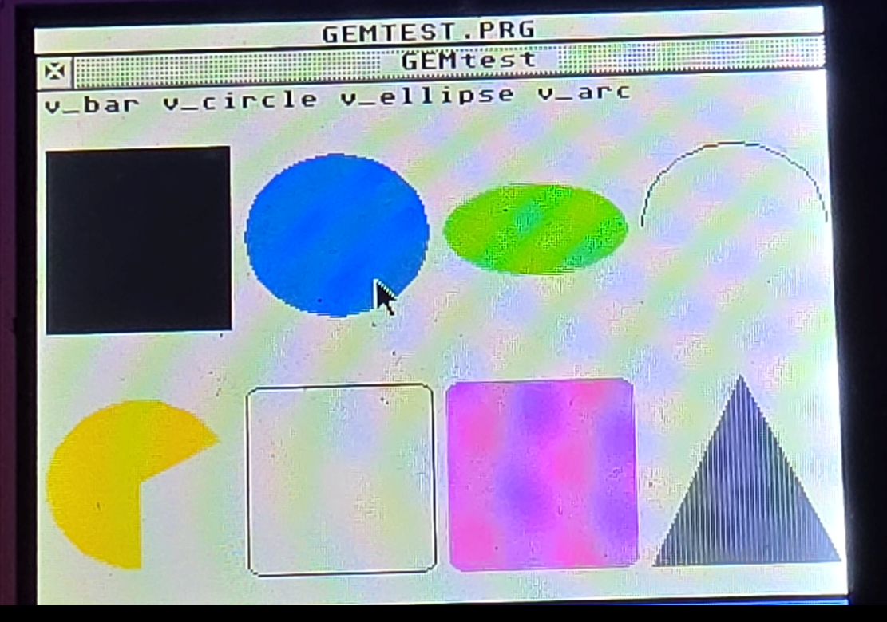
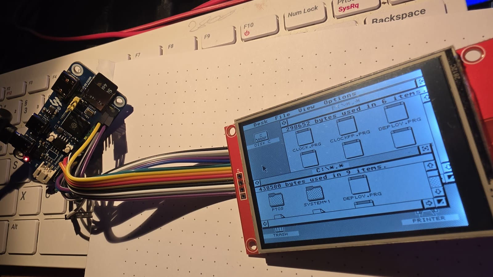

# GEMbedded

**A full graphical desktop — windows, menus, dialogues, a file manager — on a
microcontroller. Hard real-time running beside it as an ordinary application,
on the second core. And you write the programs in the Arduino IDE.**

GEMbedded runs [pTOS](https://github.com/kelihlodversson/pTOS) — a portable
descendant of EmuTOS, the free Atari TOS — on an RP2350 board with a colour
touch display, while one processor core stays free for control loops that must
be on time.

## Real time you can watch

Three computations share one core. The two fractals run flat out; the
Lissajous figure is periodic and must be on time. `late` is the worst gap
between activations, measured against the period it asked for, and it stays
under two milliseconds with both fractals iterating hard — because the kernel
is cooperative on both cores and every task hands control back by itself.

Cooperative, by the way, is not a compromise here. There is no preemption to
pay for, so a handover costs a function call, and a task that yields often is
scheduled astonishingly fast.



That is the whole idea in one picture, and it is moving because it has to be. Four GEM windows on a 2.8"
display. A Mandelbrot set and a Julia set, each computed by its own task on
the second core. An animated Lissajous figure on a slider adjustable 50 ms cycle. And a fourth
window whose sliders change, live, how the processor is divided between them,
and how often the cyclic Lissajous task is called.

It was written in the Arduino IDE, uploaded over one USB cable, and it ran all
night.

---

## What it does

- **A real GEM desktop.** Windows you drag and resize, pull-down menus, modal
  dialogues, desk accessories, a file manager, a command line. Not a widget
  toolkit that looks like one — the actual AES and VDI, running the actual
  desktop, at 320×240 in **65 536 colours**.

- **Touch is the mouse.** Tap, double tap, drag. Least-squares calibration in
  the Options menu and at boot.

- **The second core does real time, and nothing disturbs it.** Tasks are called
  on a fixed period under [IRKernel](https://github.com/Captayne/IRKernel/).
  The stepper demonstrator holds a **1 ms grid to within 8 µs** while the
  system core reads from the SD card.

- **Priorities are a share, not a rank.** A task gets processor time in the
  ratio of its own priority to the sum of all the others. Move a slider and
  watch the Mandelbrot speed up while the Julia set slows down — no task ever
  starves.

- **You develop in the Arduino IDE.** Open a sketch, press Upload: the program
  is compiled, sent over USB onto the running machine, and started there. No
  reflashing, no SD card shuffling, no reset button. The machine keeps running
  the whole time. [**docs/gemduino.md**](docs/gemduino.md) is the setup, in full.

- **Floating point on both cores.** The FPU is available to programs and to
  real-time tasks, and the kernel carries `s16`–`s31` across a task switch so
  one task cannot corrupt another's arithmetic.

- **16 MB of PSRAM**, mapped as Alt-RAM — so a program can ask for
  `Mxalloc()` of a size that would have been absurd on the machine this
  operating system comes from.

- **The SD card mounts on your PC.** One menu entry hands the whole card over
  the same USB cable as a mass storage device; partitions and all. Take it back
  and GEMDOS re-reads the medium, exactly as TOS always handled a swapped
  floppy.

- **Wi-Fi**, through an AT radio module on the second UART, with the settings
  kept by the machine.

## It compiles in the Arduino IDE

```c
int main(void)
{
    short wchar, hchar, wbox, hbox;
    short apid = appl_init();

    vdi = v_opnvwk(graf_handle(&wchar, &hchar, &wbox, &hbox));
    win = wind_create(NAME | CLOSER | SIZER | MOVER, dx, dy, dw, dh);
    ...
}
```

That is out of `Fractals/fractals.c`, unedited. A sketch is a GEM program: it
opens a window, waits for events, draws with the VDI, and may hand a
computation to the real-time core. The AES and VDI bindings ship
with the board package, and `GEMTEST.PRG` exists to prove they do what they say
— every binding has to put its arguments in the slot the operating system reads
them from, and getting one wrong draws the wrong thing without complaining.




## What is in here

| Directory     |                                                                        |
| ------------- | ---------------------------------------------------------------------- |
| `pTOS/`       | the operating system itself, a separate repository (see below)         |
| `rtcore/`     | the real-time runtime for core 1: IRKernel plus the `_RTX` mailbox     |
| `GEMduino/`   | everything written with the Arduino IDE: the board package, the AES/VDI bindings, the compiler, the example sketches |
| `GEM/`        | everything written any other way: the two-halves clock, `DEPLOY`       |
| `apps/`       | programs for the machine, and `apps/lib`, the beginnings of the SDK    |
| `tools/`      | host side: deploy, flash, screenshots, diagnostics                     |
| `docs/`       | plans, notes, licensing                                                |
| `board-test/` | bring-up sketches for the bare board                                   |

The split between `GEMduino/` and `GEM/` is by **how a program is built**, not
by what it does. Both produce ordinary GEM programs that the machine cannot
tell apart.

`pTOS/` is not part of this repository; it is the pTOS fork carrying the RP2350
port. See `docs/repositories.md`.

## The hardware

A **Waveshare RP2350-PiZero** — dual Cortex-M33 at 150 MHz, 16 MB flash, 16 MB
QSPI PSRAM — and a 2.8" SPI display with a resistive touch panel, on the
40-pin header. An SD card for files. That is the entire machine, and it costs
about what a pizza does.



## Building

Needs the Arm GNU toolchain and a Unix-like shell (WSL is fine):

```sh
cd pTOS && make rp2350_defconfig && make    # the operating system
cd rtcore && make                           # + core 1, gives ptos+rtcore.uf2
```

Flashing needs no button and no cable swap — `tools/gemflash.py` opens the
machine's USB port at 1200 baud, which asks it to reboot into the bootloader,
and copies the image onto the drive that appears:

```sh
python3 tools/gemflash.py
```

And a program, onto the running machine:

```sh
cd GEM/examples/deploy && make
python3 tools/gemdeploy.py GEM/examples/deploy/DEPLOY.PRG
```

Or open `GEMduino/sketchbook/Fractals` in the Arduino IDE and press Upload --
which is the easier road, and [docs/gemduino.md](docs/gemduino.md) is the
whole of it.

## Where it stands

It is a young port and it says so plainly. The display is 320×240 today,
though the PSRAM is there for considerably more. There is no sound. The
network is an AT module rather than a stack. Plenty of TOS software will not
run, because plenty of TOS software wants hardware this machine does not have.

What does work, works properly — and two bugs found along the way went back
upstream to EmuTOS, where they had been waiting a long time: `Maddalt()`
rejecting Alt-RAM that lies below ST-RAM, and `sd_calc_capacity()` reporting
every SDHC card half a megabyte smaller than it is.

## What is next

Higher resolutions. 480x854 in RGB565 is 800 KB of frame buffer, which is
nothing to 16 MB of PSRAM and everything to the 520 KB of internal RAM this
machine would otherwise have had.

## Licence

The code in this repository is under the MIT licence (see [LICENSE.md](LICENSE.md)), so that
programs written against it are not bound by the operating system's licence.
pTOS itself is GPL v2 or later, and IRKernel has its own licence;
`docs/licensing.md` explains what that means for the parts that are built
together.

## Thanks

To the [EmuTOS](https://emutos.sourceforge.io/) project, for keeping a free
TOS alive for twenty-five years, and to
[pTOS](https://github.com/kelihlodversson/pTOS) for making it portable enough
that this was a port rather than a rewrite.
