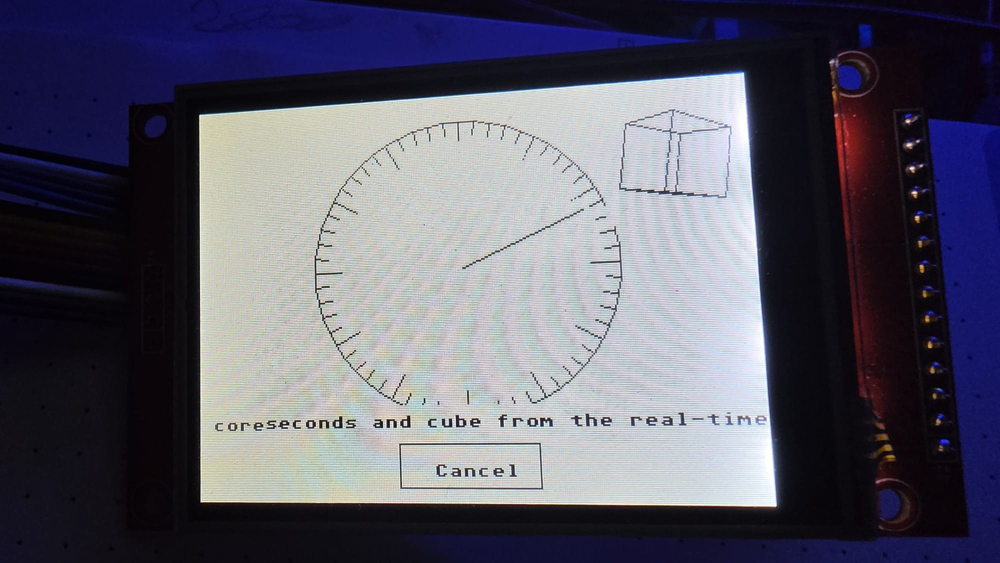

# A clock, in two halves

The dial, the hand and the cube are drawn by an ordinary GEM program on
the system core.  The seconds and the cube's corners are worked out on
the other core, by two tasks of the real-time kernel that have no
operating system to be delayed by.

| | period | what it does |
|---|---|---|
| seconds task | 1 s | counts, and sends an AES message |
| cube task | 50 ms | turns eight corners with a rotation matrix, writes them to shared memory |
| GEM half | 50 ms | draws whatever is newest |

Two ways of talking, on purpose.  The second hand arrives as an ordinary
AES message, so the GEM half waits in `evnt_multi()` exactly as it would
for a keystroke — and notifications are coalesced, so a task that reports
often cannot flood the AES.  The cube says nothing: it writes its corners
into double-buffered memory both halves can see, because at twenty frames
a second a message per frame would be the wrong mechanism.

The arithmetic is single precision, on the floating point unit both
Cortex-M33 cores have.  No lookup tables: `sinf` and `cosf` come from the
toolchain's libm, the same one Arduino uses on ARM.

Without a kernel — no `_IRK` cookie — the clock still runs, from the AES
timer, and says so under the dial.  That is the comparison.

There is a recording next to this file: `Clock-Demo.mp4`.

## Building it

    cd examples/clock && make
    powershell -File ../../tools/ptosdeploy.ps1 CLOCK.PRG

`DEPLOY.PRG` has to be running on the machine for the second line.
